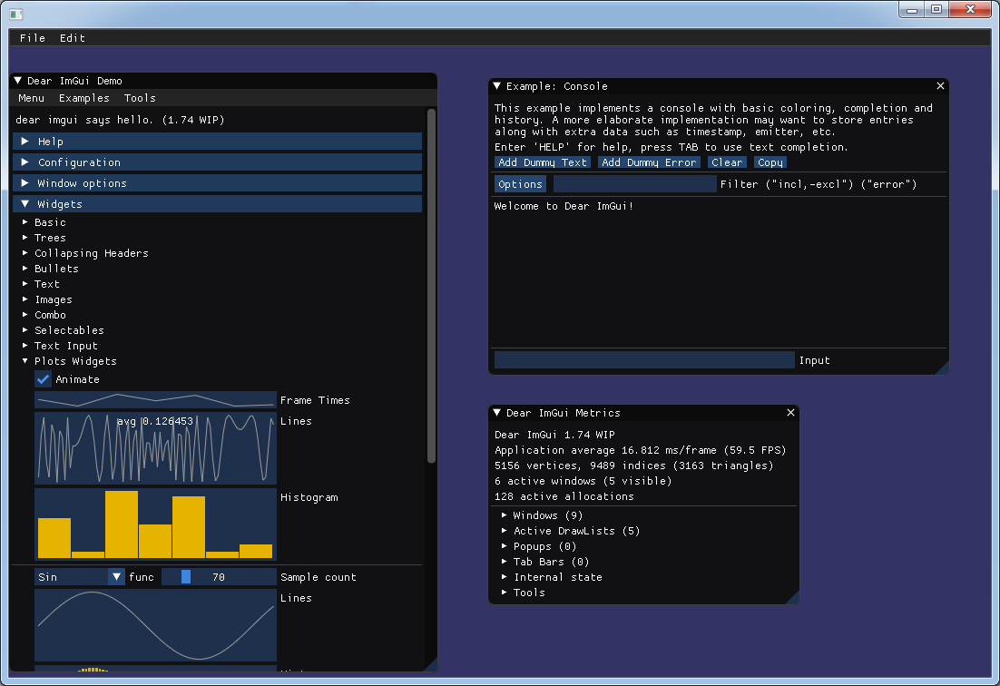

# ImGui-OSG
This application shows how to use [OpenSceneGraph](https://github.com/openscenegraph/OpenSceneGraph) and [Dear ImGui](https://github.com/ocornut/imgui) together.


## Prerequisites
This example requires:
 - OpenSceneGraph
 - OpenGL

You may install them using vcpkg on Windows or apt on Ubuntu.

## How to build
```
mkdir build && cd build
cmake ..
cmake --build .
```
